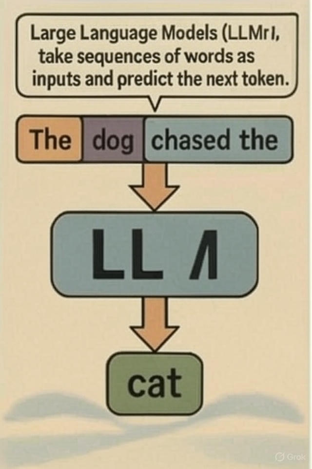
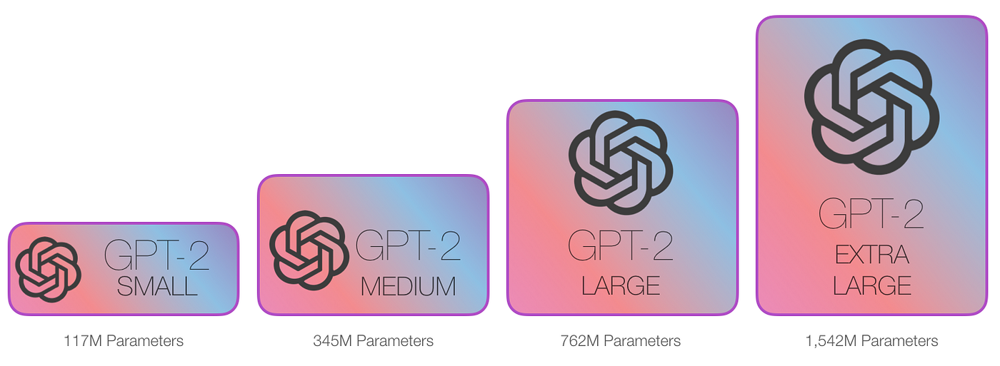
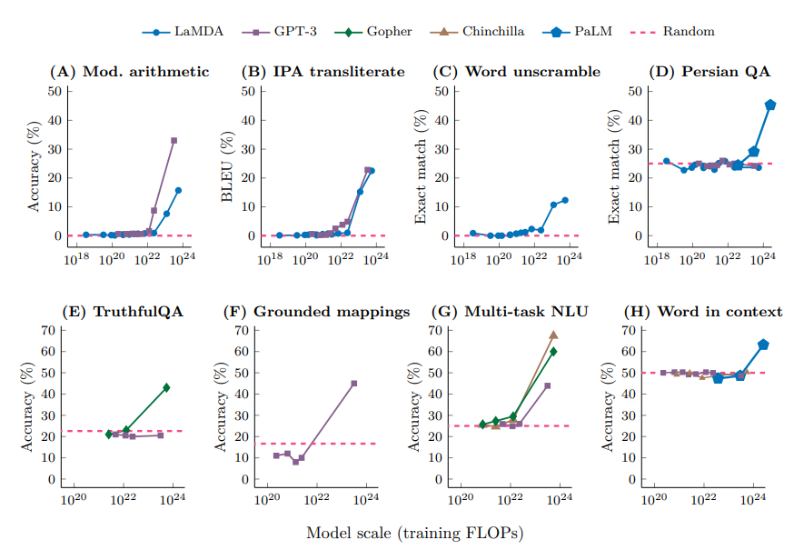
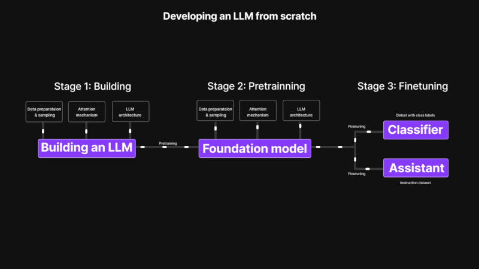

## **Day 02 - Inside the Brain of AI Agents: Large Language Models**

### **Table of contents**
1. Alien in town
2. Galileo Galilei and the importance of models
3. Large Language Models (LLMs)
4. How large is large?
5. Why do language models need to be so large?
6. Stages of training a Large Language Model (LLM)

### **1. Alien in town**

Imagine you are an alien who knows mathematics and can think.

As a thinking alien, you have access to all books and all internet data every produced by humans.

You know nothing of human language though.

Here’s your next task:

You have to predict the next word of a given sentence.

Let’s say the sentence is:

"Every effort moves you"

You have to predict the next word of the above sentence.

How will you go about doing this?

You will look for all occurrences of the sequence "Every effort moves you" in your dataset.

You will choose the most frequently appearing next word.

Great!

- What about predict the next 2 words?
- What about predicting the next 20 words?

If there are 40000 words in the English language (let's assume), the number of choices for predicting the next token is 40000.

The number of choices for predicting the next two tokens is 40000*40000 = 1.6 billion.

The number of choices for predicting the next three tokens is 40000*40000*40000 = 64 trillion.

The number of choices for predicting the next twenty tokens is more than the number of particles in the universe!

It’s impossible to statistically predict the next 20 tokens. Another issue is that you have no solution for input sequences which do not lie in the dataset.

What do we do?

### **2. Galileo Galilei and the importance of models**

Let’s learn from our ancestors.

When Galileo Galilei dropped objects from the Leaning Tower of Pisa, he recorded the time of fall of these objects.

What can we do next with these experimental observations?

Physicists convert experimental observations into models.

t = √(2h/g)

This is the model for time of fall of an object.

Models are powerful.

Even if you don’t have experimental data for some heights, you can still find the time of descent from models.

### **3. Large Language Model (LLMs)**

Returning back to our alien, can we solve the alien's problem by a model?

More specifically: can we create a model which takes in a sequence of words as input, and outputs the next token in the sequence.

Such a model can be used recursively to predict any number of words in a sequence.

Such a model is called a Large Language Model (LLM).

Large Language Models (LLMs) take sequences of words as inputs and predict the next token.

Even if the input sequence is not present in the underlying data, language models can still predict the next word.

### **4. How large is large?**

The reason we add the term "large" in "large language models" is that the models have a huge number of parameters.

Linear models have 2 free parameters.

Quadratic models have 3 free parameters.

Large Language Models have billions of free parameters!

The GPT-3 largest model has 175 billion parameters.

Finally, here is the simplest definition of Large Language Models (LLMs):

Large Language Models (LLMs) are next token prediction engines with billions of free parameters.

### **5. Why do language models need to be so large?**

Technical explanation:

LLMs have a magical property: they have emergent abilities.

An ability is emergent if it is not present in smaller models, but is present in larger models.

As you can see in the above figure, for many language tasks, language models suddenly become better after their size increases beyond a threshold.

That’s why there is such a large push for increasing the size of these models.

Intuitive explanation:

Have you thought about this:

If language models are only trained to predict the next token, how do they understand so much about language itself?

Here is my answer:

Language models are given the task to predict the next token. The models figure out that the most efficient way to do this task is by learning the language itself.

Language means form and meaning.

Language models learn the form and meaning of human language, through their next token prediction task.

Learning a language is not easy and that’s the reason language models need to have so many parameters.

### **6. Stages of building language models**

